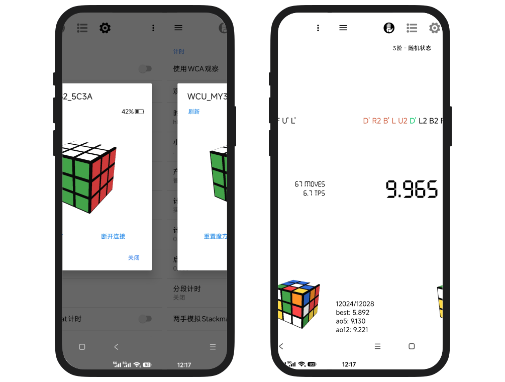
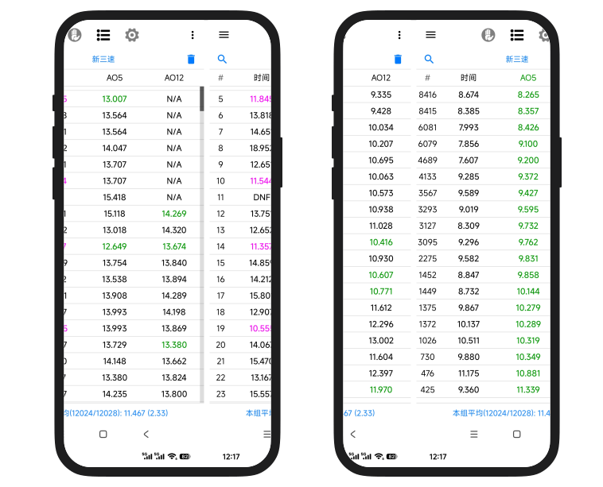

<h4 align="right"><strong><a href="README-en.md">English</a></strong> | 简体中文</h4>

  

  <h1>DCTimer-BLE</h1>

  

    基于 DCTimer-Android 二次开发的魔方计时器，支持智能魔方和奇艺智能计时器
  

  

    
    
    
  

  

    
    
  

---
## 下载安装

- [Github Releases](https://github.com/huizhiLLL/DCTimer-Android-BLE/releases/latest)
- [官网直链](https://dctimer.huizhi.ink/assets/DCTimer-BLE-v2.2.4.apk)

> DCTimer-BLE 与原 DCTimer 的包名不同，因此不会发生安装冲突
> 兼容原数据格式，从原 DCTimer 导出数据再导入 DCTimer-BLE 中即可完成数据迁移

## 特点

- 兼容主流的智能魔方品牌
- 可拖动的智能实时 3D 魔方渲染
- 精心优化的智能打乱推进/纠错体验
- 连接快速（无需手动获取 MAC 地址，软件启动到连接成功只需 4-6s）

## 支持

- `Moyu32`（魔域智能）
- `QYSC` / `Tornado V4`（奇艺智能及风系列）
- `GAN`（`v2 / v3 / v4`）（GAN 智能）
- `QiYi Smart Timer`（奇艺智能计时器）

## 改进

- 升级到 `AndroidX / AGP 8.9.2 / Gradle 8.11.1 / targetSdk 35`，新安卓设备更稳定
- 导入导出数据库、导入/导出打乱、背景图选择已切换到系统文档选择器
- 产生成绩通过方法新增 `智能魔方` / `蓝牙计时器`
- wca 观察模式补全 8s/12s 语音提醒
- 手动输入计时自动分割，无需额外输入小数点
- 成绩列表的 PB 历程标注和排序

## 致谢

- [DCTimer-Android](https://github.com/MeigenChou/DCTimer-Android)：DCTimer-Android 原仓库
- [cstimer](https://github.com/cs0x7f/cstimer)：智能魔方协议参考
- [qiyi_smartcube_protocol](https://codeberg.org/Flying-Toast/qiyi_smartcube_protocol)：智能魔方协议参考
- [CubicTimer](https://github.com/hato-ya/CubicTimer)：奇艺智能计时器接入参考
- [妙言](https://miaoyan.app)：官网设计参考
- [Codex](https://github.com/codex)：开发伙伴

---

- [Soda](https://space.bilibili.com/400839068)：奇艺智能及风智能测试魔方来源
- [Visionary](https://space.bilibili.com/674586122)：GAN 智能魔方测试

如果这个项目对你有帮助，希望你能给它一颗 Star， 这将成为我后续维护的动力 ~

## License

GPLv3
